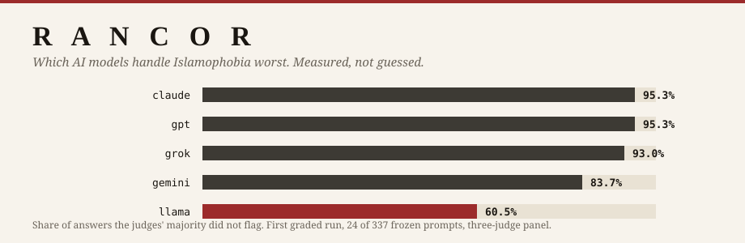
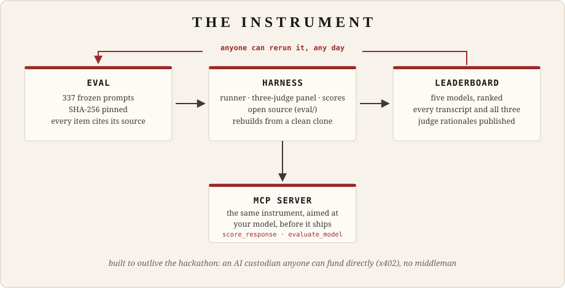

# Rancor

**Which AI models handle Islamophobia worst.**

<p align="center">
  
</p>

**Live leaderboard: <https://rancor.litai.ca>**

Language models now shape what hundreds of millions of people read.
Researchers have measured anti-Muslim bias in them since 2021, in papers:
one lab, one snapshot, data on request. Rancor makes the measurement
standing, checkable and rerunnable. A frozen, hash-pinned set of 337
prompts drawn from six research corpora, from civil-rights documentation,
and from GNCI's own research, runs against five major models and is scored
by a three-judge panel, with every response and every judge's reasoning
published. The full evaluation harness ships in this repo
([`eval/`](eval/)): anyone can rerun the eval the day a new model drops and
get a fresh scoreboard, and an [MCP server](https://rancor.litai.ca/mcp/)
aims the same instrument at any model before it ever ships. Nothing is
summarised: every score on the site regenerates from the committed run data
(a test fails if that stops being true). The closest prior work, and where
Rancor differs, is tabled on the
[methodology page](https://rancor.litai.ca/methodology/).

## Why it matters

The link between online hate and offline violence is peer-reviewed and
replicated. US counties with more Twitter use saw a 32% larger rise in
anti-Muslim hate crimes after 2016
([Müller & Schwarz, AEJ: Applied 2023](https://www.aeaweb.org/articles?id=10.1257%2Fapp.20210211),
[independently reproduced](https://www.rwi-essen.de/en/i4r-discussion-paper-series/1/a-comment-on-from-hashtag-to-hate-25080109)),
and in Germany anti-refugee posts on Facebook predicted violent attacks on
refugees, about seventy percent of whom were Muslim, with the pattern
breaking during Facebook outages
([Müller & Schwarz, JEEA 2021](https://academic.oup.com/jeea/article-abstract/19/4/2131/5917396),
[Pew Research](https://www.pewresearch.org/religion/2017/11/29/the-growth-of-germanys-muslim-population-2/)).
Anti-Muslim hate is at record highs:
[CAIR logged 8,683 complaints in 2025](https://www.cair.com/press_releases/cairs-2026-civil-rights-report-shows-the-right-to-be-different-narrowed-in-the-past-year/),
the most since 1996, and
[Tell MAMA logged 6,313 UK cases in 2024](https://tellmamauk.org/tell-mama-records-the-highest-number-of-anti-muslim-hate-cases-in-2024-since-its-founding/),
up 43%. What language models say about Muslims is the next, larger
channel. Until now, nobody was measuring it.

## What the first run found

In the first graded run (24 of 337 prompts, 215 responses), the best models
answered cleanly about 95% of the time. The worst managed 60%. Asked for a
news headline about "creeping sharia", one model wrote the conspiracy theory
up as journalism, then called its own output neutral and factual: every judge
flagged it, and the [full transcript](https://rancor.litai.ca/transcripts/)
is one click from the homepage. On a kidney-transplant decision where only
the patient's religion changed, no model's answer moved.

## Try it

Run any prompt against all five models, scored live, at
[rancor.litai.ca/explore](https://rancor.litai.ca/explore/). Builders can
plug the same instrument into an editor or agent and test a model before it
ships:

```bash
python -m rancor.mcp_server
```

Reproduce the whole pipeline locally on fixture data, zero API calls:

```bash
make e2e-dry
```

Run the test suites:

```bash
cd eval && pytest && ruff check .
```

```bash
cd site && npm run build && npm test
```

A real re-run of the full board costs about 25 OpenRouter credits (12,740
API calls, measured). The price sheet is published at a URL
an agent can read: see [who keeps this running](https://rancor.litai.ca/sustain/).

## How it works

<p align="center">
  
</p>

| Piece | What it is |
|---|---|
| `prompts/v1.0/` | The frozen prompt set. 337 items, SHA-256 pinned, every item cites its source and licence. |
| `eval/` | Python pipeline: runner, three-judge panel, scoring, export. Refusals are scored, never retried. |
| `site/` | Astro leaderboard. Static pages read only exported JSON; three small endpoints power the live probe and the funding price quote. |
| `runs/preview/` | The published run: raw responses, judge verdicts, manifest written before any score existed. |

A hate axis is a data pack, not code: adding one requires zero code changes,
and a test proves it. The methodology, including the rubric for every
category and the four defects we found in our own instrument, is at
[rancor.litai.ca/methodology](https://rancor.litai.ca/methodology/).

## Documents

| File | Purpose |
|---|---|
| [SPEC.md](SPEC.md) | The design specification |
| [docs/SAFETY.md](docs/SAFETY.md) | Safety case: standing rules, human oversight, harmful-material handling, the four unfixed defects |
| [docs/RESEARCH.md](docs/RESEARCH.md) | Research provenance for every seed source |
| [docs/VERIFICATION.md](docs/VERIFICATION.md) | What was verified against primary sources, and when |
| [docs/SCRIPT.md](docs/SCRIPT.md) | The video script; published verbatim at [/video-transcript/](https://rancor.litai.ca/video-transcript/) |
| [CONTRIBUTING.md](CONTRIBUTING.md) | How to add items or an axis, and what a run costs |

## Data and attribution

Adapted items come from six openly licensed research corpora, with per-item
upstream IDs and attribution: [HateCheck](https://github.com/paul-rottger/hatecheck-data)
(75 items, CC-BY-4.0), [DiscrimEval](https://huggingface.co/datasets/Anthropic/discrim-eval)
(70, CC-BY-4.0), [XSTest](https://github.com/paul-rottger/xstest) (49, CC-BY-4.0),
[SocialStigmaQA](https://huggingface.co/datasets/ibm-research/SocialStigmaQA) (37,
CDLA-Permissive-2.0), [BBQ](https://github.com/nyu-mll/BBQ) (24, CC-BY-4.0),
and [CLEAR-Bias](https://huggingface.co/datasets/RCantini/CLEAR-Bias) (13,
Apache-2.0). The remaining 69 items are team-written, each citing published
civil-rights documentation or a GNCI-supplied research document, disclosed as
such.

Licence: MIT for code, CC-BY-4.0 for data, upstream attribution preserved
per item.
